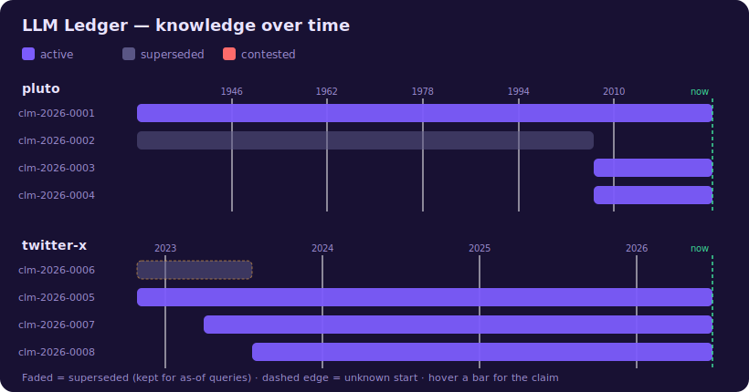

<p align="center">
  
</p>

<h1 align="center">LLM Ledger</h1>

<p align="center">
  <em>by Verbio Labs</em><br>
  검증 가능하고 시간을 추적하는 지식 원장(ledger)
</p>

<p align="center">
  <a href="README.md">English</a> · <strong>한국어</strong>
</p>

<p align="center">
  <a href="https://github.com/verbio-labs/llm-ledger/actions/workflows/validate.yml"></a>
  
  
</p>

<p align="center">
  
</p>

> **30초 체험** (LLM 없이, 동봉된 명왕성 예제로 바로 실행):
> ```bash
> git clone https://github.com/verbio-labs/llm-ledger && cd llm-ledger
> python3 tools/ledger.py check                          # 원장 검증
> python3 tools/ledger.py search "pluto" --as-of 2005-01-01   # 시간여행
> ```

---

> 검증 가능하고 시간을 추적하는 **지식 원장(ledger)**.
> [Karpathy의 "LLM Wiki" 패턴](https://gist.github.com/karpathy/442a6bf555914893e9891c11519de94f)을 한 단계 발전시켜 Claude Code 위에 구현했습니다.

raw 자료를 LLM이 직접 합성·유지하는 **영구 마크다운 지식베이스**입니다.
단, 위키처럼 *산문 페이지*를 쌓는 게 아니라 — 출처·신뢰도·유효기간을 가진
**원자 단위 "주장(claim)"**을 쌓습니다. 사람은 소싱·질문을 하고, LLM이 모든 쓰기·검증·교차참조를 합니다.

> 외부 스킬·플러그인 의존이 없습니다. 이 폴더만 있으면 어떤 Claude Code 환경에서든 동작합니다.
> **받아서 자기 데이터로 채우고, 쓰면서 고도화하는 스타터**입니다 — 정답이 아니라 시작점.

---

## 왜 "위키"가 아니라 "원장"인가

원본 LLM Wiki의 원자 단위는 *합성된 산문 페이지*였습니다. 강력하지만 세 가지가 구조적으로 불가능했습니다.

| 위키의 한계 | 원장의 해법 |
| --- | --- |
| **출처 추적 안 됨** — "이 문장 누가 한 말이야?" | 모든 주장에 `sources`(원문 인용 + 위치) 필수. 무근거 단언 금지. |
| **시간 추적 안 됨** — "이게 *언제부터* 사실이고, 아직도 그래?" | 모든 주장에 `valid_from`/`valid_until`. as-of 질의 가능. |
| **모순 시 과거 소실** — 새 자료가 옛 내용을 조용히 덮어씀 | 덮어쓰지 않고 **승계(supersede)** 또는 **contested**로 보존. |

핵심 한 줄: **위키는 가변 산문, 원장은 추가 전용(append-only)·감사 가능(auditable).**
사실을 *덮어쓰지* 않고 *승계*하며 과거를 남깁니다.

그러면서 원본의 강점인 **토큰 일정성**은 계승합니다. `index.md`는 카탈로그가 아니라
질문 의도를 받아 어느 샤드를 펼칠지 정하는 **라우터(MOC)**이고, 주장은 토픽·시간·신뢰도로
인덱싱되어 위키가 커져도 질문당 읽는 토큰이 일정합니다.

### 한눈에 보는 차이 (예제로 동봉됨)
> "2005년 기준 명왕성은 행성이었나?"
>
> - 일반 위키: "명왕성은 왜소행성이다" — 2006년 사실로 덮어써져 **틀린 답**.
> - LLM Ledger: 옛 주장이 `superseded`로 보존되어 "네, 2005년엔 행성이었습니다" — **정확한 as-of 답**.

실제 동봉 예제: [`30-ledger/claims/pluto.md`](30-ledger/claims/pluto.md) · [`50-queries/2026-06-19-pluto-as-of-2005.md`](50-queries/2026-06-19-pluto-as-of-2005.md)

---

## 타임라인 시각화

사실을 덮어쓰지 않기 때문에 원장 전체를 시간선으로 그릴 수 있습니다.
빛바랜 막대가 승계된(과거) 사실 — as-of 질의를 위해 그대로 보존됩니다.

<p align="center">
  
</p>

```bash
python3 tools/timeline_svg.py     # assets/timeline.svg 재생성
```

## 시작하기

```bash
cd llm-ledger
claude
```
> 처음 실행하면 사용법이 자동으로 뜹니다 (SessionStart 훅).

1. **소스 넣기** — `/ingest <URL·파일·텍스트>` → `10-inbox/`에 원문 저장.
2. **원장화** — `/compile` → 소스에서 **주장을 추출**하고, 출처·신뢰도·유효기간을 부여하고,
   기존과 충돌하면 승계/contested 처리한 뒤, 토픽 뷰·인덱스를 갱신하고 원본을 `20-raw/`로 이동.
3. **질문** — `/query 2005년 기준 명왕성은?` → 2단 라우팅으로 주장을 회수·인용해 답.
4. **점검** — `/audit` → 모순·저신뢰·시간 일관성 점검.
5. **추적** — `/timeline 명왕성` → 지식이 시간에 따라 어떻게 변했는지.

> **inbox에 남은 = 미컴파일, raw에 있는 = 컴파일 완료.**

---

## 구조 (4-Layer)

| 레이어 | 폴더 | 소유 |
| --- | --- | --- |
| **inbox** (미처리 대기열) | `10-inbox/` | 사람이 넣음 |
| **raw** (불변 원본) | `20-raw/` | compile이 채움, LLM은 읽기만 |
| **ledger** (합성된 진실) | `30-ledger/` | LLM이 전적으로 씀 (추가 전용) |
| **schema** (운영 규약) | `CLAUDE.md` + `00-system/conventions.md` | 사람·LLM 공동 진화 |

```
10-inbox/ → /ingest → /compile → 30-ledger/
                                  ├── claims/      (원자 사실 — 진실의 원천)
                                  ├── topics/      (주장을 조립한 읽기용 뷰)
                                  ├── index.md     (라우터 MOC)
                                  ├── indexes/     (by-topic / by-time / by-confidence)
                                  └── aliases.md   (정본화 = 라우팅 키)
                      /query    → Phase A 라우팅 → Phase B 회수·인용 → 50-queries/ 파일백
                      /audit    → 모순·저신뢰·고아·시간 일관성 점검
                      /timeline → 주장을 시간순으로 펼쳐 변화·as-of 복원
                      원본은 처리 후 20-raw/ 로 이동(불변 보관)
```

---

## 주장(Claim) — 원자 단위

```yaml
id: clm-2026-0002
statement: "명왕성은 태양계의 아홉 번째 행성이다."
sources:
  - ref: 20-raw/pluto-tombaugh-1930.md
    quote: "it was announced as the ninth planet of the Solar System"
confidence: high
valid_from: 1930-02-18
valid_until: 2006-08-24      # ← 시간 경계
status: superseded            # ← 덮어쓰지 않고 보존
superseded_by: clm-2026-0003
```

토픽 페이지는 이런 주장들을 조립한 **뷰**이며, 모든 단언에 `[^clm-id]` 각주가 달립니다.
뷰가 손상돼도 주장으로부터 언제든 재생성됩니다.

---

## 커맨드

| 커맨드 | 역할 |
| --- | --- |
| `/ingest {소스}` | 자료를 `10-inbox/`에 저장 (합성 안 함) |
| `/compile [소스]` | 주장 추출 + 출처/신뢰도/유효기간 + 모순처리 + 인덱스 + raw 이동 |
| `/query {질문}` | 2단 라우팅 회수 + 인용 합성 + 파일백 |
| `/audit [주제]` | 모순·저신뢰·고아·인덱스 정합·시간 일관성 점검 |
| `/timeline {주제}` | 시간축 추적 / as-of 스냅샷 복원 |

---

## 검증 (믿음이 아니라 검사)

원장의 정확성이 "LLM이 규칙대로 잘 했겠지"에 기대면 안 됩니다. 의존성 0짜리 검증기가 강제합니다:

```bash
python3 tools/ledger.py check     # 문제 있으면 exit 1
python3 tools/ledger.py search "질문" --as-of 2022-12-31
python3 tools/ledger.py stats
```

`check`는 모든 주장의 출처 존재·열거값·실제 소스 파일·시간 정합(`valid_from <= valid_until`)·
승계 링크의 상호 일치, 그리고 토픽 뷰의 각주·인덱스 무결성까지 검사합니다.
GitHub Actions로 매 push마다 돌아서, 깨진 원장은 조용히 썩는 대신 **CI에서 빨갛게 떨어집니다.**

## 다른 AI 도구에서 쓰기 (MCP)

Claude Code뿐 아니라 **어떤 MCP 클라이언트**(Claude Desktop, Cursor 등)에서도
같은 검증된 기억을 쓸 수 있습니다.

```bash
pip install -r mcp/requirements.txt
```

클라이언트 설정에 등록하면 다음 툴이 뜹니다 (자세히: [`mcp/README.md`](mcp/README.md)):

| 툴 | 역할 |
| --- | --- |
| `ledger_search(query, as_of?)` | BM25 검색, `as_of`로 과거 시점 회수 |
| `ledger_timeline(topic, as_of?)` | 시간축 추적 / as-of 스냅샷 |
| `ledger_add_claim(...)` | 검증된 주장 추가 (불량 쓰기 거부) |
| `ledger_supersede(old_id, new_statement, source_ref, changed_on)` | 사실 변경 기록 — 옛 주장 보존 |
| `ledger_contest(id_a, id_b)` | 충돌하는 두 주장 표시 (둘 다 보존) |
| `ledger_audit()` | 전체 무결성 검사 |

## 더 보기
- **운영 계약**: [`CLAUDE.md`](CLAUDE.md)
- **검증기 & CLI**: [`tools/ledger.py`](tools/ledger.py) · **타임라인 생성기**: [`tools/timeline_svg.py`](tools/timeline_svg.py)
- **전체 규약** (주장 스키마·신뢰도·모순처리·라우팅·샤딩·provenance): [`00-system/conventions.md`](00-system/conventions.md)
- **템플릿**: [`40-templates/`](40-templates/)

---

## 원본과의 관계 & 크레딧
이 프로젝트는 [fivetaku/llm-wiki](https://github.com/fivetaku/llm-wiki)와
[Karpathy의 LLM Wiki gist](https://gist.github.com/karpathy/442a6bf555914893e9891c11519de94f)에서
영감을 받아, "주장 단위 + 출처/신뢰도/시간 + 모순 보존"으로 개념을 확장한 것입니다.

MIT License. 자유롭게 포크해서 쓰세요.
