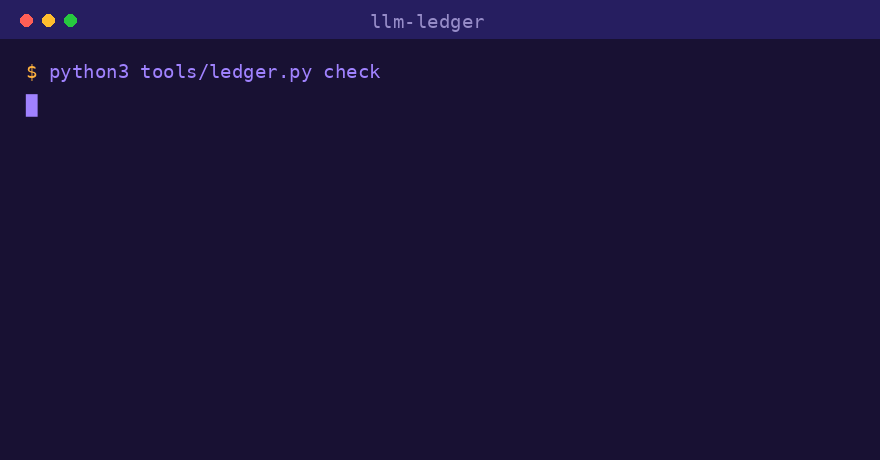

<p align="center">
  
</p>

<h1 align="center">LLM Ledger</h1>

<p align="center">
  <em>by Verbio Labs</em><br>
  A verifiable, time-aware knowledge ledger your LLM keeps for you.
</p>

<p align="center">
  <strong>English</strong> · <a href="README.ko.md">한국어</a>
</p>

<p align="center">
  <a href="https://github.com/verbio-labs/llm-ledger/actions/workflows/validate.yml"></a>
  
  
  
</p>

<p align="center">
  
</p>

> **Try it in 30 seconds** (no LLM needed — runs on the shipped Pluto example):
> ```bash
> git clone https://github.com/verbio-labs/llm-ledger && cd llm-ledger
> python3 tools/ledger.py check                          # validate the ledger
> python3 tools/ledger.py search "pluto" --as-of 2005-01-01   # time-travel
> ```

---

A permanent markdown knowledge base that an LLM synthesizes and maintains for you —
an evolution of [Karpathy's "LLM Wiki" pattern](https://gist.github.com/karpathy/442a6bf555914893e9891c11519de94f),
implemented on top of Claude Code.

But instead of accumulating *prose pages* like a wiki, it accumulates **atomic "claims"** —
each with its sources, a confidence level, and a validity window in time. You do the sourcing
and the asking; the LLM does every write, every verification, and every cross-reference.

> No external skills or plugins. This folder alone runs in any Claude Code environment.
> **Take it, fill it with your own data, and grow it as you go** — a starter, not a final answer.

---

## Why a "ledger," not a "wiki"

The original LLM Wiki's atomic unit was a *synthesized prose page*. Powerful — but three things were structurally impossible:

| Wiki's limitation | The ledger's fix |
| --- | --- |
| **No provenance** — "who actually said this sentence?" | Every claim requires `sources` (original quote + locator). No unsourced assertions. |
| **No time-awareness** — "since *when* was this true, and is it still?" | Every claim carries `valid_from` / `valid_until`. As-of queries work. |
| **Past lost on conflict** — new sources silently overwrite old text | Nothing is overwritten. Facts are **superseded** or marked **contested**, never erased. |

In one line: **a wiki is mutable prose; a ledger is append-only and auditable.**
We don't *overwrite* facts — we *supersede* them and keep the past.

And it inherits the original's best idea — **constant token cost.** `index.md` is not a catalog;
it's a **router (MOC)** that takes the intent of a question and decides which shard to open. Claims are
indexed by topic, time, and confidence, so the per-question token budget stays flat as the ledger grows.

### The difference at a glance (shipped as a live example)
> "As of 2005, was Pluto a planet?"
>
> - A normal wiki: "Pluto is a dwarf planet" — overwritten by the 2006 fact, so it gives the **wrong answer**.
> - LLM Ledger: the old claim is preserved as `superseded`, so it answers "Yes — in 2005 it was a planet." — the **correct as-of answer**.

See it in the repo: [`30-ledger/claims/pluto.md`](30-ledger/claims/pluto.md) · [`50-queries/2026-06-19-pluto-as-of-2005.md`](50-queries/2026-06-19-pluto-as-of-2005.md)

---

## Quick start

```bash
cd llm-ledger
claude
```
> A usage guide pops up automatically on first run (a SessionStart hook).

1. **Add a source** — `/ingest <URL · file · text>` saves the original into `10-inbox/`.
2. **Ledger it** — `/compile` **extracts claims** from the source, assigns provenance / confidence / validity,
   resolves conflicts (supersede or contested), refreshes topic views and indexes, then moves the original to `20-raw/`.
3. **Ask** — `/query Was Pluto a planet in 2005?` retrieves and cites claims via two-stage routing.
4. **Check** — `/audit` scans for contradictions, low confidence, and temporal inconsistency.
5. **Trace** — `/timeline pluto` shows how the knowledge changed over time.

> **In inbox = not yet compiled. In raw = compiled.**

---

## Architecture (4 layers)

| Layer | Folder | Owner |
| --- | --- | --- |
| **inbox** (uncompiled queue) | `10-inbox/` | you drop sources here |
| **raw** (immutable originals) | `20-raw/` | filled by compile, LLM reads only |
| **ledger** (synthesized truth) | `30-ledger/` | written entirely by the LLM (append-only) |
| **schema** (operating spec) | `CLAUDE.md` + `00-system/conventions.md` | co-evolved by human + LLM |

```
10-inbox/ → /ingest → /compile → 30-ledger/
                                  ├── claims/      (atomic facts — the source of truth)
                                  ├── topics/      (read-only views assembled from claims)
                                  ├── index.md     (router MOC)
                                  ├── indexes/     (by-topic / by-time / by-confidence)
                                  └── aliases.md   (canonicalization = routing keys)
                      /query    → Phase A routing → Phase B retrieve & cite → 50-queries/ file-back
                      /audit    → contradictions · low-confidence · orphans · temporal checks
                      /timeline → unfold claims chronologically; reconstruct as-of snapshots
                      originals move to 20-raw/ after processing (kept immutable)
```

---

## A claim — the atomic unit

```yaml
id: clm-2026-0002
statement: "Pluto is the ninth planet of the Solar System."
sources:
  - ref: 20-raw/pluto-tombaugh-1930.md
    quote: "it was announced as the ninth planet of the Solar System"
confidence: high
valid_from: 1930-02-18
valid_until: 2006-08-24      # ← temporal boundary
status: superseded            # ← preserved, not overwritten
superseded_by: clm-2026-0003
```

A topic page is a **view** assembled from claims like these, with a `[^clm-id]` footnote on every
assertion. If a view is ever damaged, it can be regenerated from the claims at any time.

---

## Commands

| Command | What it does |
| --- | --- |
| `/ingest {source}` | Save material into `10-inbox/` (no synthesis) |
| `/compile [source]` | Extract claims + provenance/confidence/validity + conflict handling + indexes + move to raw |
| `/query {question}` | Two-stage routed retrieval + cited synthesis + file-back |
| `/audit [topic]` | Contradictions · low-confidence · orphans · index integrity · temporal consistency |
| `/timeline {topic}` | Trace over time / reconstruct an as-of snapshot |

---

## Validation (trust, not vibes)

The ledger's correctness shouldn't depend on the LLM behaving. A tiny zero-dependency
validator enforces it:

```bash
python3 tools/ledger.py check     # exit 1 if anything is wrong
python3 tools/ledger.py search "your question" --as-of 2022-12-31
python3 tools/ledger.py stats
```

`check` verifies every claim has provenance, valid enums, a real source file, sane
temporal bounds (`valid_from <= valid_until`), and reciprocal supersession links —
plus footnote and index integrity across topic views. It runs on every push via
GitHub Actions, so a broken ledger fails CI instead of silently rotting.

## Learn more
- **Operating contract**: [`CLAUDE.md`](CLAUDE.md)
- **Validator & CLI**: [`tools/ledger.py`](tools/ledger.py)
- **Full spec** (claim schema, confidence, conflict handling, routing, sharding, provenance): [`00-system/conventions.md`](00-system/conventions.md)
- **Templates**: [`40-templates/`](40-templates/)

---

## Lineage & credits
Inspired by [fivetaku/llm-wiki](https://github.com/fivetaku/llm-wiki) and
[Karpathy's LLM Wiki gist](https://gist.github.com/karpathy/442a6bf555914893e9891c11519de94f),
extending the concept toward "claims as the unit + provenance/confidence/time + conflicts preserved."

MIT License. Fork it freely.

<p align="center"><sub>🦉 Verbio Labs</sub></p>
